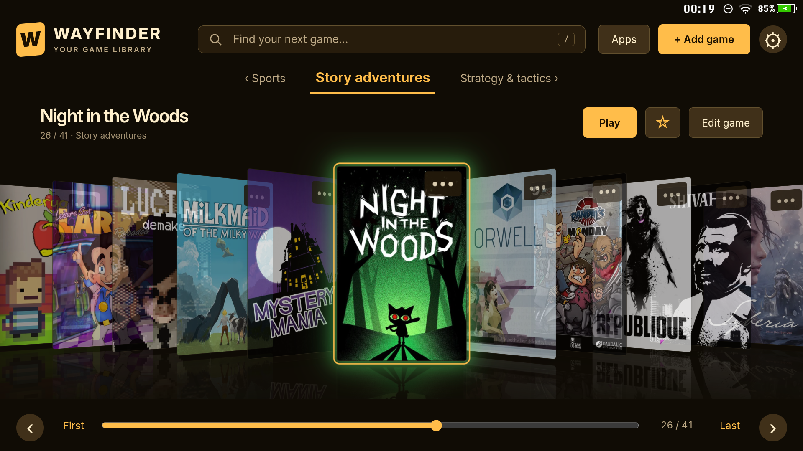
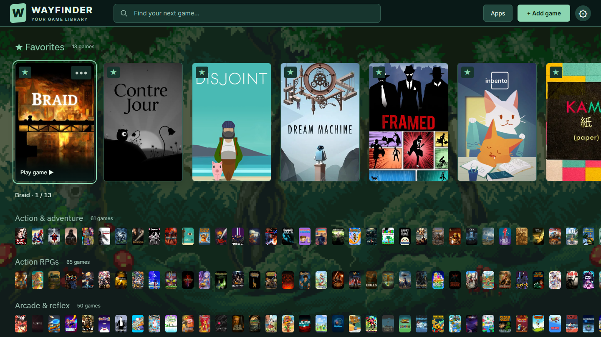

# Wayfinder

**A minimal, visually focused launcher for large Android game collections.**

Wayfinder makes a substantial library of Android games easy to browse with a touchscreen and game controller. It puts cover artwork, clear categories, and quick navigation at the center of the experience.

It is designed specifically for **launching Android games**. It is not intended as a general-purpose retro-gaming frontend, emulator manager, or ROM organizer.



*Cupertino presentation theme · Amber Terminal color scheme.*



*Vienna presentation theme · Expandable category shelves.*

## Design philosophy

Wayfinder aims to be aesthetically pleasing without becoming elaborate.

**One picture per game.** A title’s cover is its visual identity. The interface keeps attention on the collection rather than adding layers of trailers, logos, screenshots, and metadata.

The goal is simple: make a library of hundreds—or thousands—of Android games inviting to explore and straightforward to launch.

## Features

- **Seven presentation themes:** Alexandria, Kyoto, Cupertino, Tokyo, Seattle, Vienna, and Oxford.
- **Categories, search, and sorting** for navigating large collections.
- **Favorites and recently played games**, with sampled category shelves in Seattle.
- **Touch and controller navigation**, including fast scrolling and page controls.
- **Editable titles, categories, and cover artwork.**
- **An integrated artwork picker:** retrieve images from Google Play, open Google Images or SteamGridDB searches, or choose a local image.
- **Artwork fitting and cropping**, with options to fit or fill game tiles.
- **Eleven color schemes**, including bright green and pink, warm Parchment, Midnight Blue, Sea Glass, Terracotta, and Graphite.
- **Eight typography choices:** Computer, Editorial, Clean, Space Grotesk, Outfit, Oxanium, Space Mono, and IBM Plex Sans, all included for offline use.
- **An optional soft glow** sampled from the selected cover.
- **Optional interface sounds and background audio** from a user-selected file.
- **An optional startup video**, with support for a custom replacement.
- **An app drawer** for non-game Android apps, with customizable icons and rearrangeable pins.
- **Optional Android home-screen integration.**
- **Library and custom artwork backup and restore.**

## Requirements

Wayfinder is designed for an **Android device with both a touchscreen and a game controller**.

Both are part of the intended experience: the controller handles everyday browsing and launching, while the touchscreen supports setup, editing, artwork selection, and direct navigation.

- Android 8.0 or later.
- A touchscreen.
- A game controller with a D-pad, shoulder buttons, and triggers.
- Landscape display orientation.

A television or controller-only setup is not the intended target.

## Getting started

1. Install Wayfinder on your Android device.
2. Add installed Android games to your library.
3. Organize them into categories and choose their cover images.
4. Select a presentation theme and color scheme.
5. Browse with touch or controller and launch a game.

To use Wayfinder as your home screen, choose **Set as default launcher** in Settings.

Adding a library entry does not install the game. Games must already be installed on the device.

## Controller controls

| Control | Action |
|---|---|
| D-pad | Navigate |
| A | Activate or play |
| B | Back |
| X | Edit game |
| Y | Search |
| LB / RB | Previous / next category |
| LT / RT | Page up / page down |
| Left stick click | Open apps |
| Right stick click | Toggle favorite |
| Start | Open settings |

## Local library, personal artwork

Your library and selected artwork are stored on the device. Browsing does not require an internet connection; retrieving online artwork does.

You supply your games and media. Artwork remains the property of its respective creators. Interface sounds include Kenney assets and original Wayfinder Soft Terminal sounds, released under CC0.

## Project status

Wayfinder is an evolving personal project, developed and tested with a large Android game collection on a handheld device. Compatibility across other devices and controllers is still being established.

Its scope is deliberately narrow: **a beautiful, minimal home for Android games.**

## Build from source

Use Android Studio with JDK 17 or later and Android SDK 35. Open this folder as a Gradle project and let Android Studio configure your local SDK path.

Build a debug APK:

```sh
./gradlew assembleDebug
```

On Windows, use `gradlew.bat assembleDebug`. The APK is written to `app/build/outputs/apk/debug/`.

Fresh installations start with an empty library. The collection shown in the screenshot is an example; its games and cover files are not bundled.

The Android application ID is `com.androidgyny.wayfinder`. Local release builds currently use the debug signing configuration; use your own signing key for distribution. No signing keys are included in this repository.

Typography uses Inter (Clean), Lora (Editorial), IBM Plex Mono (Computer), Space Grotesk, Outfit, Oxanium, Space Mono, and IBM Plex Sans under the SIL Open Font License. Notices are included in `app/src/main/assets/www/fonts/`.
