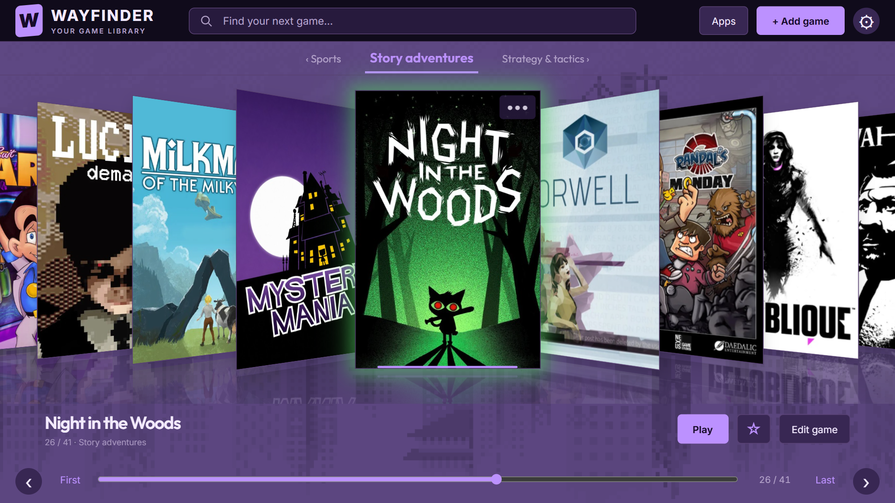
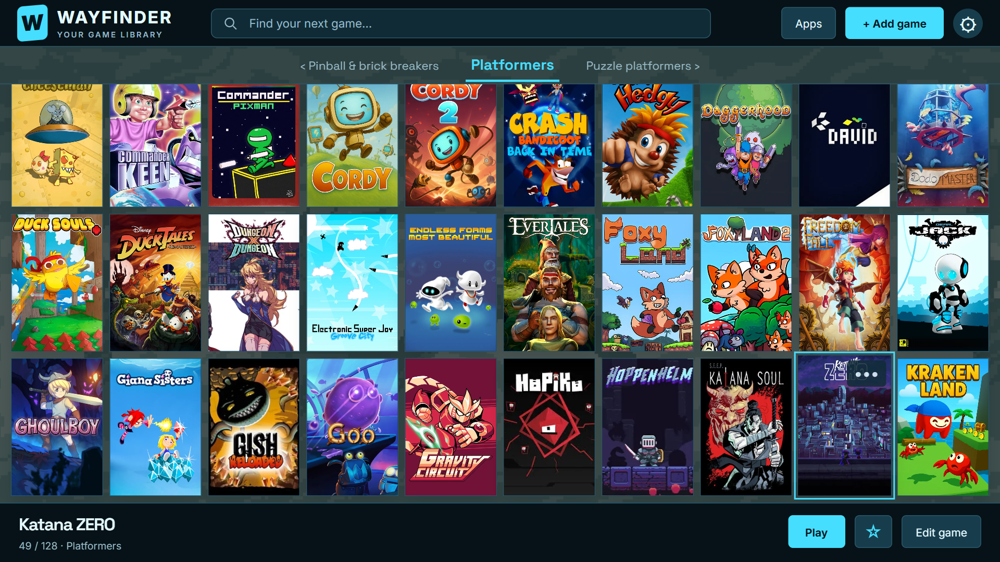
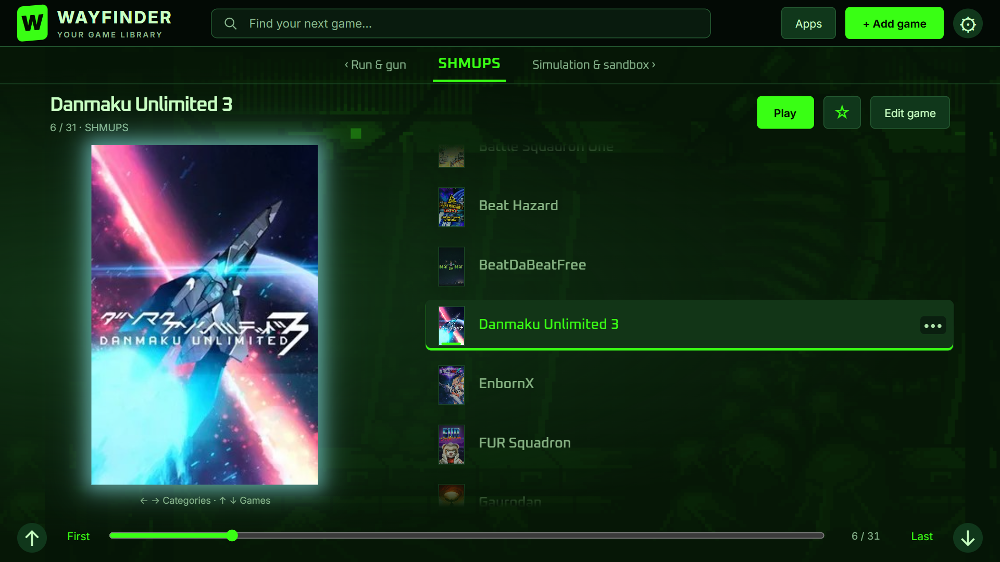
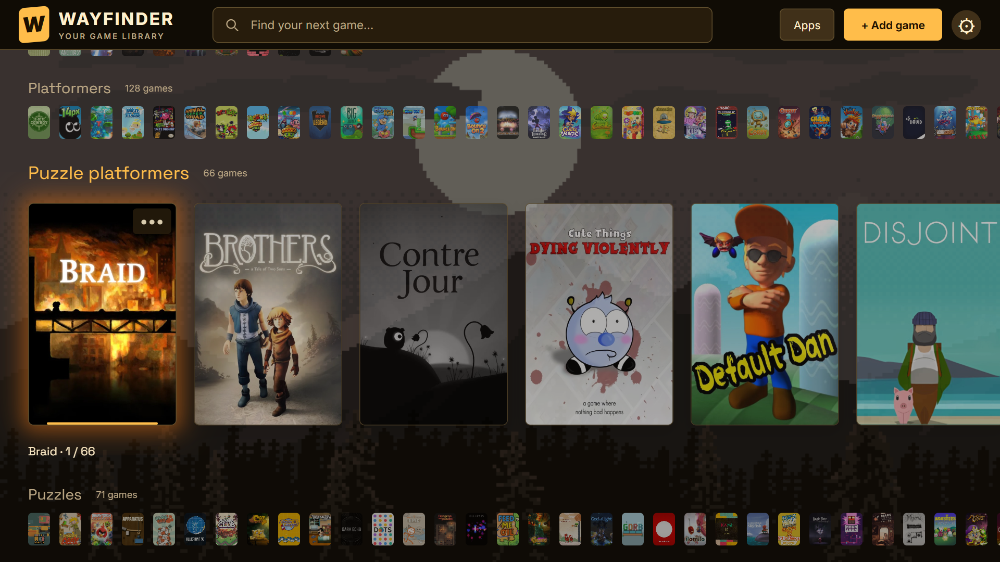
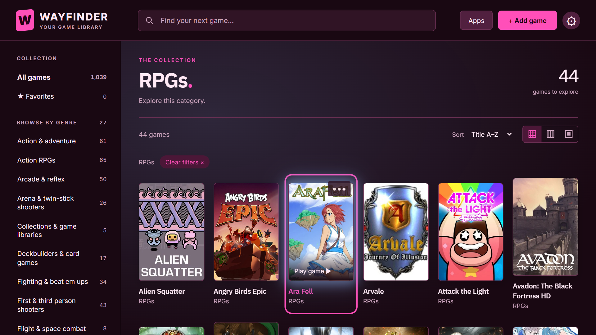

#  Wayfinder

**A minimal, visually focused launcher for large Android game collections.**

> **Beta software.** This is a vibe-coded app made with the help of **GPT-6 Astra**.

[Download the beta APK](https://github.com/androidgyny/wayfinder/releases/tag/v0.9.55-beta.4)

Wayfinder makes a substantial library of Android games easy to browse with a touchscreen and game controller. It puts cover artwork, clear categories, and quick navigation at the center of the experience.

It is designed specifically for **launching Android games**. It is not intended as a general-purpose retro-gaming frontend, emulator manager, or ROM organizer.

## Design philosophy

Wayfinder aims to be aesthetically pleasing without becoming elaborate.

**One picture per game.** A title’s cover is its visual identity. The interface keeps attention on the collection rather than adding layers of trailers, logos, screenshots, and metadata.

The goal is simple: make a library of hundreds—or thousands—of Android games inviting to explore and straightforward to launch.

## Features

- **One library, many ways to browse.** Eight presentation themes offer cover grids, category shelves, title lists, and Cover Flow. Change the layout without reorganizing your games.
- **Built for large collections.** Editable categories, title search, sorting, favorites, and recently played games help you find something quickly. Seattle adds shuffled selections from your categories for a little discovery.
- **Touch and controller together.** Swipe through covers, navigate precisely with the D-pad, switch categories with the shoulder buttons, and jump through long lists with the triggers.
- **One cover per game, chosen by you.** Edit titles and categories; find artwork through Google Play, Google Images, or SteamGridDB, or use a local image. Fit the whole image or fill the cover frame.
- **Make the library your own.** Mix eleven color schemes and eight bundled typography choices with cover spacing, reflections, halos, and selection styles where supported. Start from a built-in appearance preset or save your own.
- **Quiet or animated backgrounds.** Choose a flat color, soft gradient, one of five bundled parallax scenes, or your own still or animated image. Adjust dimming and keep the original colors, mute them, or match your palette.
- **Optional sound and startup animation.** Retro computer sound effects, a bundled ambient music loop or your own audio, and a responsive opening animation with synchronized sound. You can also choose a custom startup video or turn the opening off.
- **Your other Android apps, too.** A searchable app drawer includes editable icons and pins you can drag into order. Wayfinder can also be set as the device's default home screen.
- **Keep your collection.** Back up and restore your library and custom artwork.

## Requirements

Wayfinder is designed for an **Android device with both a touchscreen and a game controller**.

Both are part of the intended experience: the controller handles everyday browsing and launching, while the touchscreen supports setup, editing, artwork selection, and direct navigation.

- Android 8.0 or later.
- A touchscreen.
- A game controller with a D-pad, shoulder buttons, and triggers.
- Landscape display orientation.

A television or controller-only setup is not the intended target.

## Getting started

1. Install Wayfinder on your Android device.
2. Add installed Android games to your library.
3. Organize them into categories and choose their cover images.
4. Select a presentation theme and color scheme.
5. Browse with touch or controller and launch a game.

To use Wayfinder as your home screen, choose **Set as default launcher** in Settings.

Adding a library entry does not install the game. Games must already be installed on the device.

## Controller controls

| Control | Action |
|---|---|
| D-pad | Navigate |
| A | Activate or play |
| B | Back |
| X | Edit game |
| Y | Search |
| LB / RB | Previous / next category |
| LT / RT | Page up / page down |
| Left stick click | Open apps |
| Select | Toggle favorite |
| Start | Open settings |

## Appearance gallery

Seven looks from the same library, combining presentation themes, typography, palettes, and backgrounds. These are captures of the current app interface in a browser with an example collection; games and personal cover artwork are not bundled. Animated backgrounds are shown as still frames.

### Cupertino · Violet · Outfit

Urban skyline, matched to Violet, with classic reflections and a soft cover halo. Night in the Woods is selected.



### Berlin · Cyan · Space Grotesk

A dense cover grid over a muted Another World backdrop, with Katana ZERO selected.



### Oxford · Parchment · Editorial

A quiet title list with Tengami selected, backed by Mountain dusk matched to the Parchment palette.


### Tokyo · Hacker Green · Oxanium

Danmaku Unlimited 3 beside a title list, with Alien Environment matched to Hacker Green.



### Vienna · Amber · Space Grotesk

Braid on the expanded category shelf, with compact neighboring shelves and a muted Mountain dusk backdrop.



### Kyoto · Sea Glass · Space Grotesk

Large rounded covers over Magical road in its original colors, with Mimpi selected and its title below.


### Alexandria · Hot Pink · IBM Plex Sans

Ara Fell selected in a cover grid with sidebar categories, a soft gradient, and a cover halo.



## Local library, personal artwork

Your library and selected artwork are stored on the device. Browsing does not require an internet connection; retrieving online artwork does.

You supply your games and media. Artwork remains the property of its respective creators. Interface sounds include Kenney assets and original Wayfinder Soft Terminal sounds, released under CC0.

## Project status

Wayfinder is an evolving personal project, developed and tested with a large Android game collection on a handheld device. Compatibility across other devices and controllers is still being established.

Its scope is deliberately narrow: **a beautiful, minimal home for Android games.**

## Build from source

Use Android Studio with JDK 17 or later and Android SDK 35. Open this folder as a Gradle project and let Android Studio configure your local SDK path.

Build a debug APK:

```sh
./gradlew assembleDebug
```

On Windows, use `gradlew.bat assembleDebug`. The APK is written to `app/build/outputs/apk/debug/`.

Fresh installations start with an empty library. The collection shown in the screenshots is an example; its games and cover files are not bundled.

The Android application ID is `com.androidgyny.wayfinder`. Local release builds currently use the debug signing configuration; use your own signing key for distribution. No signing keys are included in this repository.

Typography uses Inter (Clean), Lora (Editorial), IBM Plex Mono (Computer), Space Grotesk, Outfit, Oxanium, Space Mono, and IBM Plex Sans under the SIL Open Font License. Notices are included in `app/src/main/assets/www/fonts/`.

Bundled ambient music: **Another August** by **The Cynic Project / Alex Smith** ([cynicmusic.com](https://cynicmusic.com/), [Pixelsphere](https://pixelsphere.org/)), released under [CC0 1.0](https://creativecommons.org/publicdomain/zero/1.0/). [Original track](https://opengameart.org/node/73989). Wayfinder uses a 3:07 adaptation with a 20-second crossfade for continuous looping.

The built-in six-second startup animation adapts to the screen proportions and includes the original Wayfinder jingle. You can disable it, mute its sound, or choose your own startup video.
