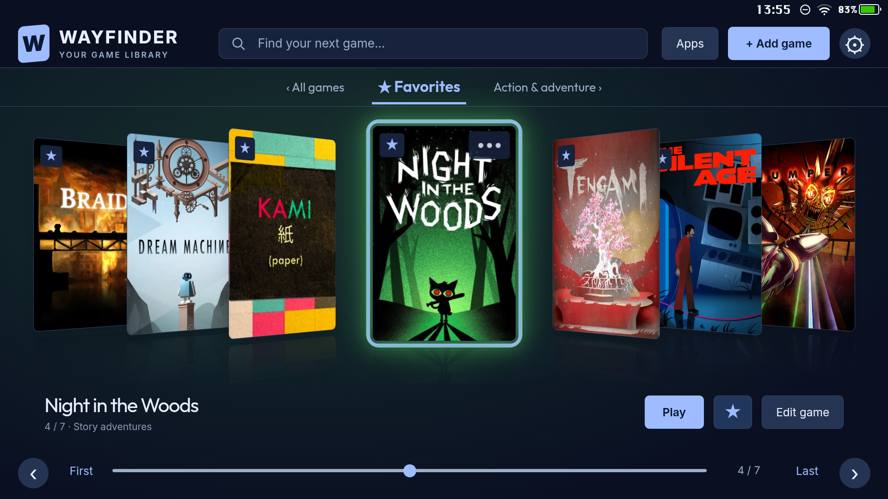
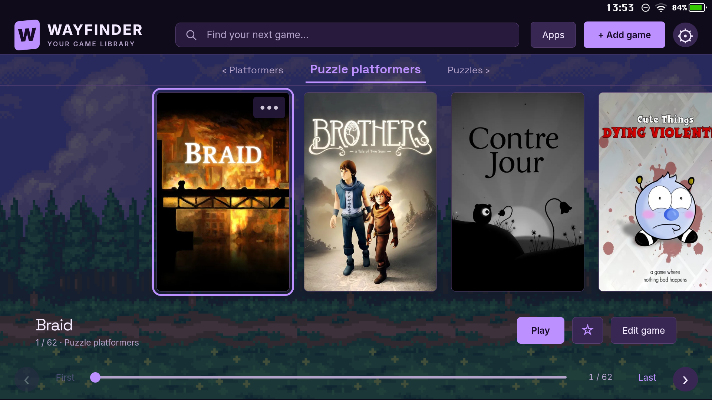
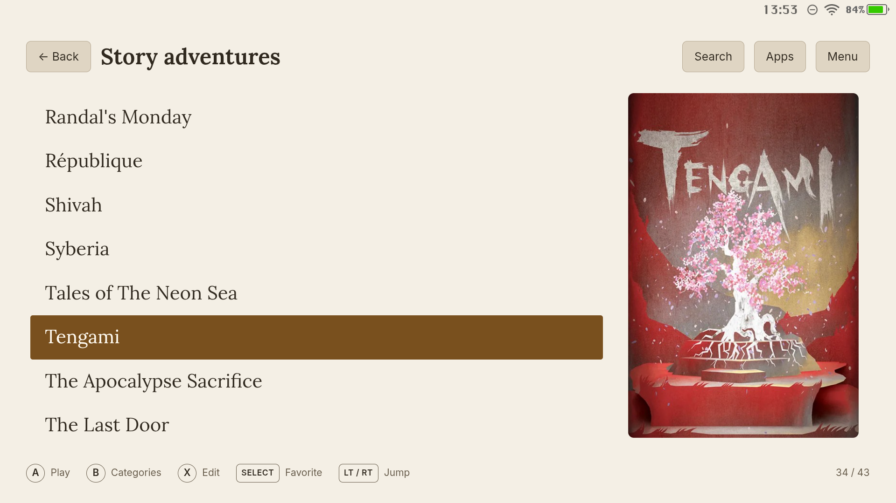

#  Wayfinder

**A personal home for your Android game collection.**

> **Beta software.** Made with the help of **GPT-6 Astra**.

[Download the beta APK](https://github.com/androidgyny/wayfinder/releases/tag/v0.9.134-beta.7)

Wayfinder is an Android game launcher: an app for organizing, browsing, and opening games you already have installed. It brings your collection together with cover artwork, categories, search, and controller navigation, so choosing what to play feels like browsing a library.

It is built for Android handhelds with a touchscreen and a game controller. You can open it like any other app or make it your Android home screen.



*Cupertino · Midnight palette · a cover-led view of your favorites.*

[Explore all ten app screenshots →](docs/GALLERY.md)

## What you can do

- **Build your library.** Add installed games, edit their titles, and organize them into categories that make sense to you.
- **Find something to play.** Search your collection, sort it, mark favorites, or revisit recently played games.
- **Give each game a cover.** Find artwork through Google Play, open Google Images or SteamGridDB searches, or choose an image from your device. Adjust how it fits the tile.
- **Choose how you browse.** Switch between cover grids, shelves, carousels, dashboards, and text-focused layouts.
- **Make it your own.** Customize colors, fonts, backgrounds, selection effects, and sound. Preview appearance presets or save your own combinations.
- **Keep other apps close.** Open the app drawer for non-game apps and pin the ones you use most.
- **Back up your collection.** Export your library and custom covers, then restore them from a saved backup.

Wayfinder focuses on the collection itself: one cover per game, clear organization, and quick access to play. Games are supplied and installed separately. Wayfinder does not install games, run emulators, or manage ROM collections.

## What you need

- Android 8.0 or later.
- A touchscreen and a game controller.
- A landscape display.
- Some installed games to add to your library.

The controller is intended for everyday browsing and launching. The touchscreen is also part of the experience, especially for setup, editing, and choosing artwork. Television and controller-only setups are not the intended target.

## Getting started

1. **Install the Wayfinder APK** on your Android device. If Android asks, allow installation from the app you used to open the file.
2. **Open Wayfinder and choose Add game.** Add a game that is already installed on the device.
3. **Choose its title, category, and cover.** You can return to the game editor to change these later.
4. **Open Settings to choose a look.** Start with an appearance preset, or select a presentation theme and adjust it yourself.
5. **Select a game and launch it.** Browse using touch or your controller.

To open Wayfinder whenever you press Home, go to **Settings → Home & startup → Set as default launcher**. Using it as your home screen is optional.

## Choose your layout

A **presentation theme** changes how your library is arranged. Colors, backgrounds, fonts, and other appearance settings let you style that layout separately.

The current layouts are Alexandria, Berlin, Cambridge, Copenhagen, Cupertino, Kyoto, Oxford, Prague, Seattle, Tokyo, Ulm, Venice, and Vienna. They range from artwork-led browsing to compact text lists, so you can choose what suits your collection and screen.

You can also enable interface sounds, play the included background music or your own audio, and choose a startup video. These options are available in Settings.



*Kyoto · Violet palette · large covers against the Magical Road backdrop.*



*Ulm · Parchment palette · a quiet list with one selected cover.*

These screenshots come directly from the app running on a Pimax Portal. Games and personal cover artwork are not bundled. [See all ten layouts and their appearance settings in the gallery.](docs/GALLERY.md)

## Controller reference

These are the default controls. Navigation adapts to the active layout or menu.

| Control | Action |
|---|---|
| D-pad | Navigate |
| A | Select or launch |
| B | Go back |
| X | Edit the selected game |
| Y | Search |
| LB / RB | Previous / next category |
| LT / RT | Page up / page down |
| Left stick click | Open the app drawer |
| Select / Back button | Toggle favorite |
| Start | Open settings |

## Your library and backups

Your library and saved artwork stay on your device. You can browse them offline; finding new artwork online requires an internet connection.

Use **Settings → Library → Back up** to export your titles, categories, and custom covers. **Restore** replaces the current library with the contents of a backup. A library backup does not include installed games or their save files.

## Project status

Wayfinder is an actively evolving personal project, developed and tested with a large game collection on a Pimax Portal. Support for other Android devices and controllers is still being established.

If you report a problem, include your device, Android version, Wayfinder version, controller, selected layout, and the steps that reproduce it.

## Credits

Game artwork belongs to its respective creators. Interface audio includes Kenney assets and original Wayfinder Soft Terminal sounds. The included background track, *Another August*, is by The Cynic Project / Alex Smith. These audio assets are provided under CC0; attribution details are included with the project assets.

## Build from source

Open this folder in Android Studio with JDK 17 or later and Android SDK 35. Let Android Studio configure your local SDK path, then build a debug APK:

```sh
./gradlew assembleDebug
```

On Windows, use `gradlew.bat assembleDebug`. The APK is written to `app/build/outputs/apk/debug/`. Fresh installations start with an empty library.

The application ID is `com.androidgyny.wayfinder`. Local release builds currently use the debug signing configuration; use your own signing key for distribution. No signing keys are included in the repository.

Bundled fonts use the SIL Open Font License. Their notices are included in `app/src/main/assets/www/fonts/`.
