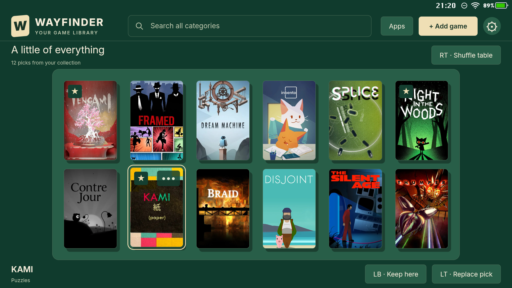
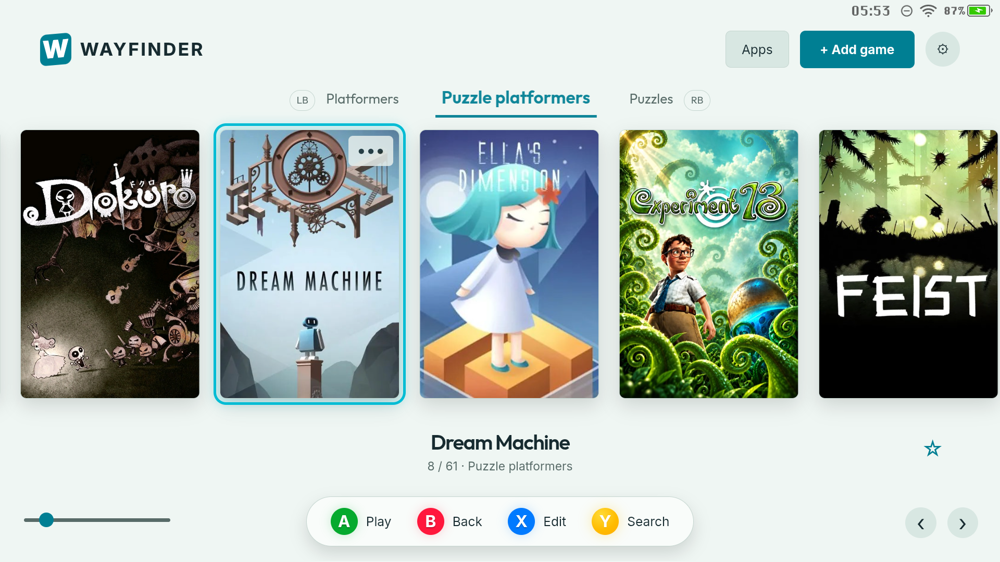
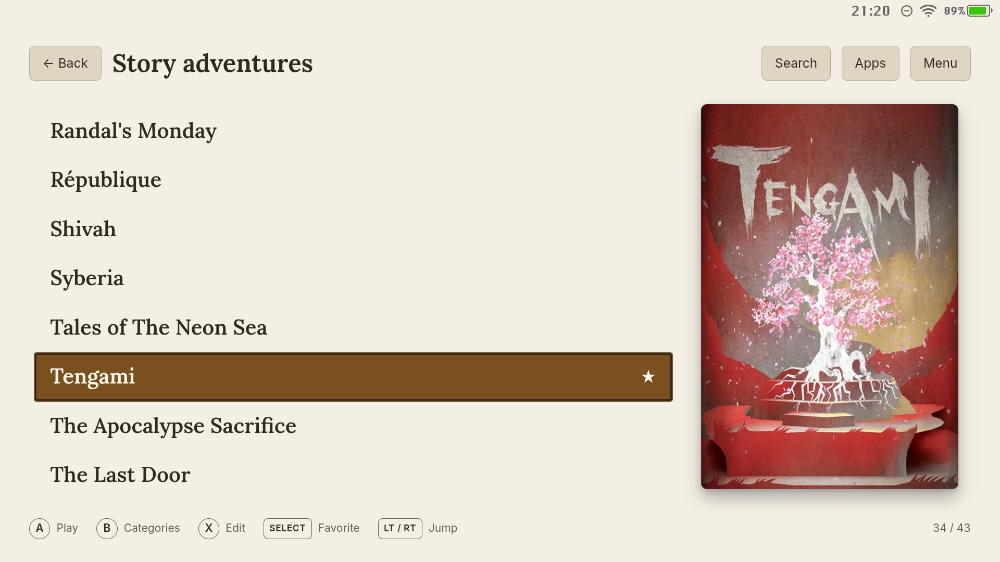
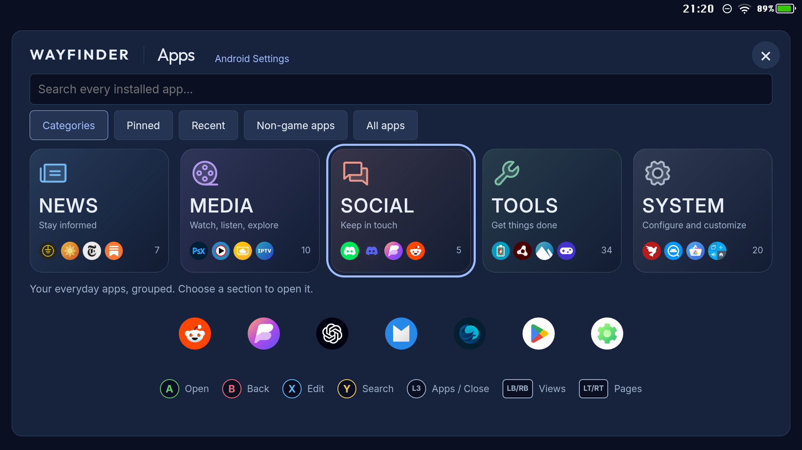

#  Wayfinder

**A console-like home for a large Android game collection.**

> **Beta software.** Made with the help of **GPT-6 Astra**.

[Download the beta APK](https://github.com/androidgyny/wayfinder/releases/tag/v0.9.148-beta.10)

Wayfinder is an app for **organizing, browsing, and launching large collections of Android games**. It turns installed games into a personal library of covers and categories, with controller navigation and a choice of ways to browse. The goal is a console-like experience: pick up your handheld, find something you want to play, and launch it.

It is designed for Android handhelds with a touchscreen and a game controller. You can open Wayfinder like any other app or make it your Android home screen. Games are installed separately; Wayfinder organizes and opens them.



*Copenhagen · Full House preset · a table of games to discover.*

[Explore the screenshot gallery →](docs/GALLERY.md)

## A little setup, many ways to browse

**A category and an image are the core of each entry.** Wayfinder takes the game's name from the installed app, and you can edit it if needed. Choose a category that makes sense to you and artwork you like. There is no checklist of release dates, developers, descriptions, ratings, or other metadata to complete.

That restraint is intentional. With hundreds or thousands of games, every extra field becomes work repeated across the collection. Organizing a library should leave you time to enjoy it.

**Wayfinder makes those few details go a long way.** The same categories and images work across twelve layouts: cover grids, shelves, carousels, dashboards, card arrangements, and compact text lists. You can give artwork room to shine, scan many titles at once, or explore a category a few games at a time. Switching views does not mean preparing your collection again.

## Built for a growing collection

- **Organize in batches.** Rename or merge categories, move several games at once, and drag categories into your preferred order.
- **Find and rediscover games.** Search titles across your library, browse by category, sort, mark favorites, and revisit recently played games.
- **Choose artwork easily.** Find images through Google Play, open Google Images or SteamGridDB searches, or use a file from your device. Preview and adjust how it fits.
- **Set the mood.** Start with an appearance preset, or adjust colors, fonts, backgrounds, borders, shadows, selection effects, and sound. Preview a preset before keeping it, and save your own combinations.
- **Keep everyday apps nearby.** The Apps screen groups apps into News, Media, Social, Tools, and System. A dock holds eight favorites; All apps and a Non-game apps filter provide broader access. Use installed icon packs or your own images to personalize app icons.
- **Maintain your library.** Library information shows counts, storage use, and entries needing attention. Export a backup of your organization and artwork before making larger changes.

Wayfinder does not supply or install games, run emulators, or manage ROM collections. It is a home for the Android games you already have.

## What you need

- Android 8.0 or later.
- A touchscreen and a game controller.
- A landscape display.
- Some installed games to add to your library.

The controller is intended for everyday browsing and launching. The touchscreen is also part of the experience, especially for setup, editing, and choosing artwork. Television and controller-only setups are not the intended target.

## Getting started

1. **Install the Wayfinder APK** on your Android device. If Android asks, allow installation from the app you used to open the file.
2. **Open Wayfinder and choose Add game.** Add a game that is already installed on the device.
3. **Choose a category and cover.** Keep the app's name or edit it. You can change any of these later.
4. **Open Settings to choose a look.** Start with an appearance preset, or select a presentation theme and adjust it yourself.
5. **Select a game and launch it.** Browse using touch or your controller.

To open Wayfinder whenever you press Home, go to **Settings → Home & startup → Set as default launcher**. Using it as your home screen is optional.

The **Help** page in Settings provides a brief guide to everyday use.

## Choose your layout

A **presentation theme** changes how your library is arranged. Colors, backgrounds, fonts, and other appearance settings let you style that layout separately.

Wayfinder includes twelve layouts: Alexandria, Berlin, Cambridge, Copenhagen, Cupertino, Kyoto, Oxford, Prague, Seattle, Ulm, Venice, and Vienna. You do not need to learn their names before starting—try an appearance preset and see which approach suits your collection and screen.

You can also enable interface sounds, play the included background music or your own audio, and choose a startup video. These options are available in Settings.



*Kyoto · Smitchish preset · a spacious cover shelf and colorful controller dock. Shown in the current development build; not yet in the Beta 10 APK.*



*Ulm · Parchment palette · a quiet title list with one selected cover and soft shadows.*



*Apps · your everyday essentials, with grouped apps and a favorites dock.*

App icons shown use [Australis – Icon Pack by UNVOID](https://play.google.com/store/apps/details?id=com.unvoid.australis), available separately on Google Play. Section illustrations use [Phosphor Icons](https://phosphoricons.com/).

These screenshots come directly from the app running on a Pimax Portal. Games and personal cover artwork are not bundled. [See all ten screenshots of library views and the Apps screen in the gallery.](docs/GALLERY.md)

## Controller reference

These are the default controls. Navigation adapts to the active layout or menu.

| Control | Action |
|---|---|
| D-pad | Navigate |
| A | Select or launch |
| B | Go back |
| X | Edit the selected game |
| Y | Search |
| LB / RB | Previous / next category |
| LT / RT | Page up / page down |
| Left stick click | Open the app drawer |
| Select / Back button | Toggle favorite |
| Start | Open settings |

## Your library and backups

Your library and saved artwork stay on your device. You can browse them offline; finding new artwork online requires an internet connection.

Use **Settings → Library → Back up** to export your titles, categories, category order, custom covers, and app drawer preferences. **Restore** replaces the current library with the contents of a backup. A library backup does not include installed games or their save files.

App drawer preferences include names, pins and their order, section assignments, hidden-from-section choices, custom images, and individually selected pack icons. Icon packs themselves are not included; reinstall them separately. Missing pack icons fall back to the app's original icon. Overall appearance settings—including the global icon pack, layout, and theme—and custom background, music, font, and startup media are not included. Restoring a library leaves those device settings in place.

## Project status

Wayfinder is an actively evolving personal project, developed and tested with a large game collection on a **Pimax Portal (Snapdragon 865), running Android 10 at 1920 × 1080 resolution**. Support for other Android devices and controllers is still being established.

If you report a problem, include your device, Android version, Wayfinder version, controller, selected layout, and the steps that reproduce it.

## Credits

Game artwork belongs to its respective creators. Interface audio includes [Interface Sounds by Kenney](https://kenney.nl/assets/interface-sounds) and original Wayfinder Soft Terminal sounds. The included background track, [*Another August*](https://opengameart.org/node/73989), is by [The Cynic Project / Alex Smith](https://cynicmusic.com/). These audio assets are provided under CC0; attribution details are included with the project assets.

Pixel-art backdrops are adapted from artwork by [Luis Zuno / ansimuz](https://ansimuz.itch.io/): [Mountain at Dusk](https://opengameart.org/content/mountain-at-dusk-background), [Magical Road](https://opengameart.org/content/magical-road-pixel-art-environment), [Urban Landscape](https://opengameart.org/content/urban-landscape), [Sideview Sci-Fi](https://opengameart.org/content/sideview-sci-fi-patreon-collection) (Alien Environment and Another World), [Fort of Illusion](https://opengameart.org/content/fort-of-illusion), [Underwater Diving](https://opengameart.org/content/underwater-diving-pack), and [Forest of Illusion](https://opengameart.org/content/sunnyland-forest-of-illusion). See the [background asset notices](app/src/main/assets/www/backgrounds/NOTICE.txt) for licenses and adaptation details.

Bundled fonts come from [Google Fonts](https://github.com/google/fonts) under the SIL Open Font License. Individual license notices are included in the [fonts directory](app/src/main/assets/www/fonts/).

App section artwork uses [Phosphor Icons](https://phosphoricons.com/) under the [MIT license](app/src/main/assets/www/LICENSE-Phosphor.txt).

## Build from source

Open this folder in Android Studio with JDK 17 or later and Android SDK 35. Let Android Studio configure your local SDK path, then build a debug APK:

```sh
./gradlew assembleDebug
```

On Windows, use `gradlew.bat assembleDebug`. The APK is written to `app/build/outputs/apk/debug/`. Fresh installations start with an empty library.

The application ID is `com.androidgyny.wayfinder`. Local release builds currently use the debug signing configuration; use your own signing key for distribution. No signing keys are included in the repository.
