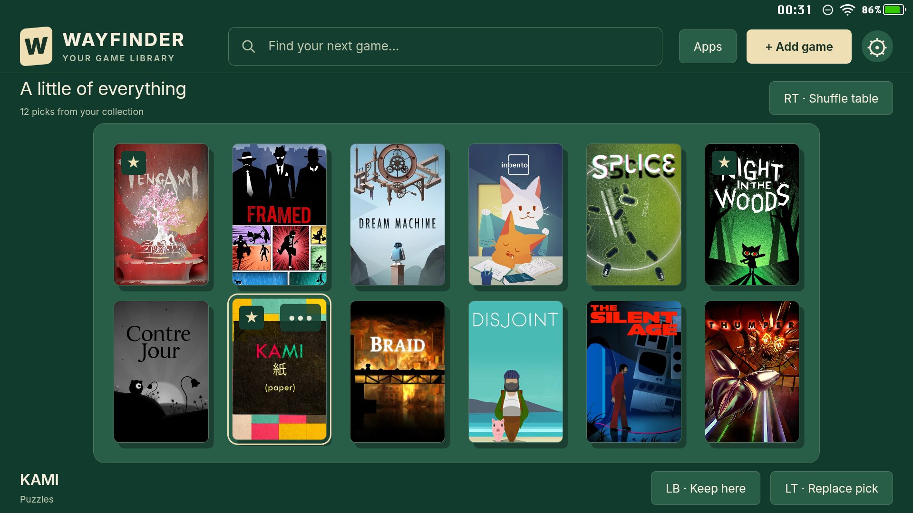
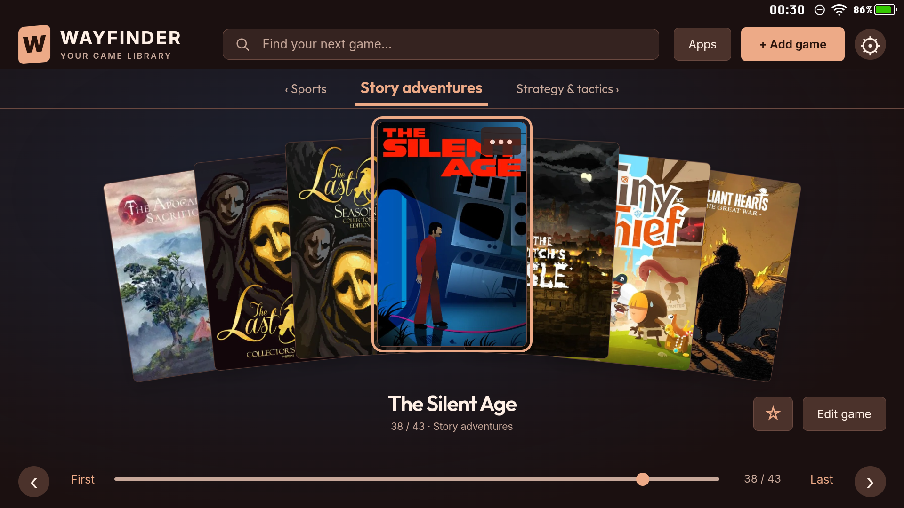
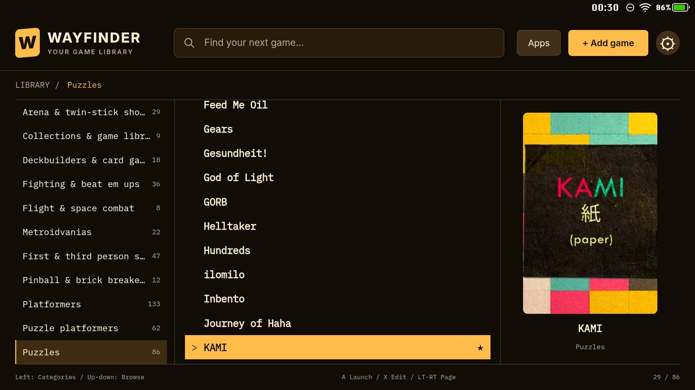
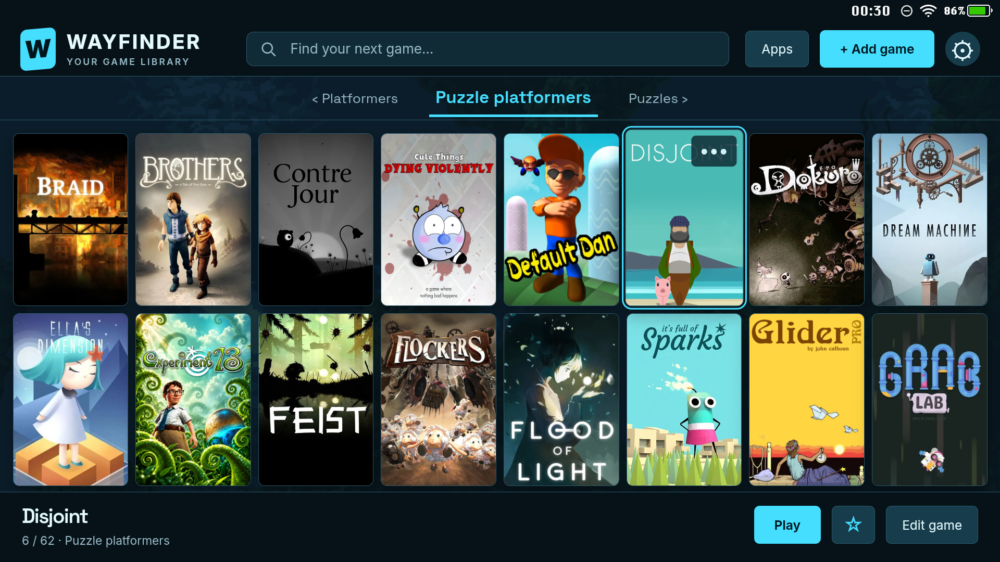
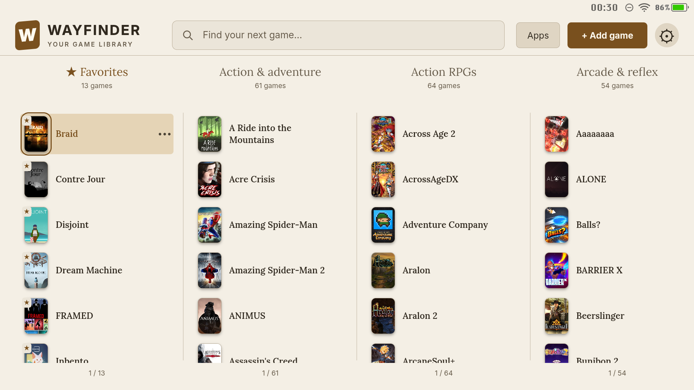
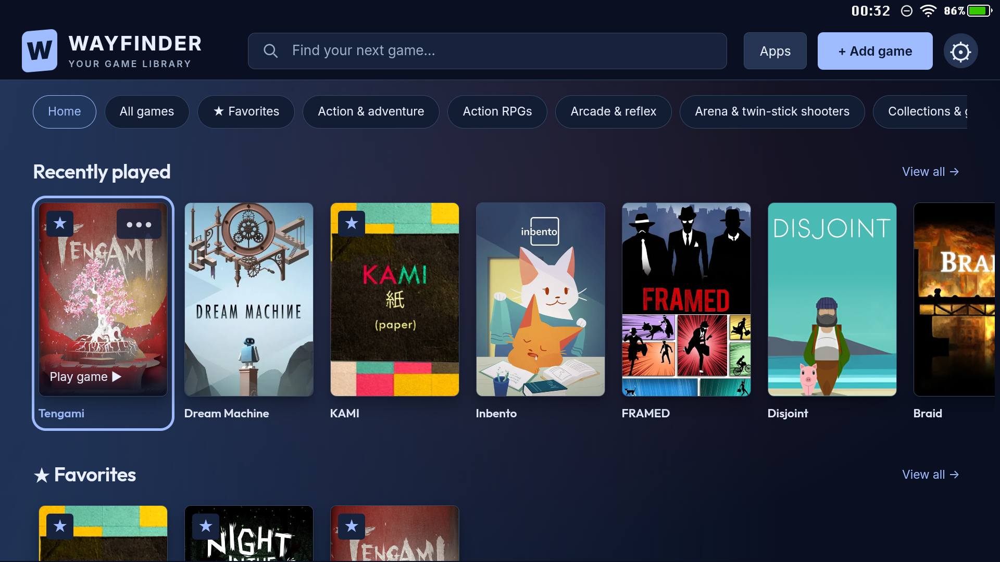
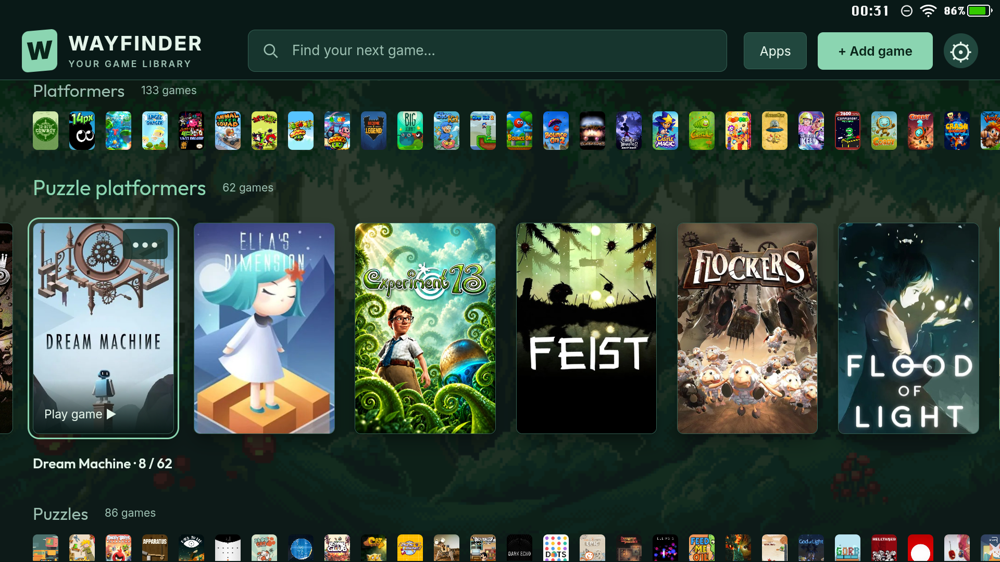

# Wayfinder screenshot gallery

[← Back to the README](../README.md)

One cover per game, ten different ways to explore. From a quiet title list to a card table, carousel, or wall of artwork, these views show how differently the same collection can feel.

Captured directly on a Pimax Portal at **1920 × 1080** on September 23, 2026. These are unretouched screenshots of the current development build; some appearance details may be newer than the published beta. Favorites, recent-game selections, and the Copenhagen table were arranged for the gallery. Games and personal cover artwork are not bundled with Wayfinder. Animated backdrops appear as still frames.

[Copenhagen](#copenhagen) · [Cupertino](#cupertino) · [Ulm](#ulm) · [Venice](#venice) · [Cambridge](#cambridge) · [Kyoto](#kyoto) · [Berlin](#berlin) · [Prague](#prague) · [Seattle](#seattle) · [Vienna](#vienna)

## Copenhagen

**Full House** — Felt · Default typography · Flat · Crisp shadows

Twelve games on a green felt table, with warm ivory accents and KAMI selected. Keep a pick, replace it, or shuffle the table.

## Cupertino

**Midnight favorites** — Midnight · Outfit · Soft Gradient · Artwork glow

Night in the Woods anchors a carousel of favorites, with angled covers and soft reflections.

## Ulm

**Paper and quiet** — Parchment · Editorial · Flat · Soft shadows

A spacious title list, understated controller hints, and a single Tengami cover show the quieter side of Wayfinder.

## Venice

**A fan of stories** — Terracotta · Outfit · Soft Gradient

A symmetrical fan of adventure covers surrounds The Silent Age, with warm accents and a restrained background.

## Cambridge

**The amber directory** — Amber · IBM Plex Mono · Flat

Categories, titles, and artwork occupy three clear panes. KAMI brings a little color to a compact, text-focused browser.

## Kyoto

**A little magic** — Violet · Space Grotesk · Magical Road

Large upright covers fill a shelf of puzzle platformers, with Dream Machine selected against a dim pixel-art landscape.

## Berlin

**Room for a collection** — Cyan · Space Grotesk · Underwater · Soft shadows

Sixteen covers fit into two complete rows. Disjoint is selected in a dense, easy-to-scan category grid.

## Prague

**The paper catalogue** — Parchment · Editorial · Flat · Soft shadows

Four category columns put favorites, action adventures, action RPGs, and arcade games side by side, with small covers and readable titles.

## Seattle

**Pick up a favorite** — Midnight · Outfit · Soft Gradient · Soft shadows

The dashboard brings recently played games and favorites together, with category navigation close at hand.

## Vienna

**Woodland shelves** — Sea Glass · Outfit · Forest Illusion · Soft shadows

An expanded shelf of puzzle platformers sits between compact previews of neighboring categories over a subdued forest backdrop.

[← Back to the README](../README.md)
