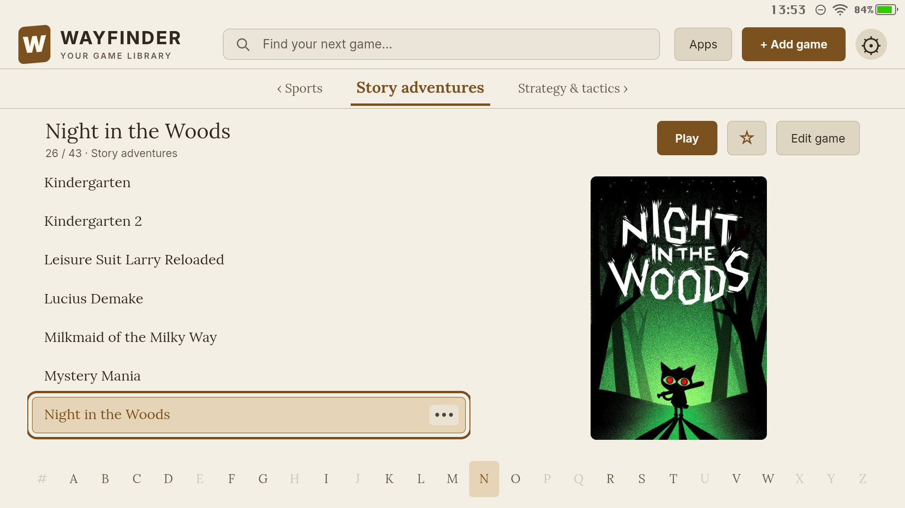
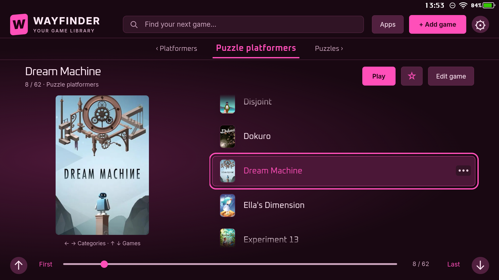

# Wayfinder screenshot gallery

[← Back to the README](../README.md)

Wayfinder starts with a minimal idea: **one image per game**. It offers many ways to present that simple collection, with a wide choice of layouts, colors, typography, and backgrounds. These ten views show how differently the same library can feel.

These are fresh, unretouched 1920×1080 screenshots captured directly from Wayfinder 0.9.139 running on a Pimax Portal. The layouts, selections, and two discovery/favorites arrangements were composed for this gallery. Games and personal cover artwork are not included with Wayfinder. Animated backgrounds appear here as still frames; this development build may include changes newer than the published beta.

[Cupertino](#cupertino) · [Kyoto](#kyoto) · [Ulm](#ulm) · [Venice](#venice) · [Cambridge](#cambridge) · [Berlin](#berlin) · [Oxford](#oxford) · [Tokyo](#tokyo) · [Vienna](#vienna) · [Copenhagen](#copenhagen)

## Cupertino

**Midnight favorites** — Midnight · Outfit · Soft Gradient

A favorite at the center of the collection, surrounded by angled covers, soft reflections, and a glow drawn from its artwork. Night in the Woods is selected.

## Kyoto

**A little magic** — Violet · Space Grotesk · Magical Road

Large, upright covers sit against a dim violet landscape. Braid anchors a shelf of puzzle platformers.

## Ulm

**Paper and quiet** — Parchment · Editorial · Flat

Warm paper tones, generous typography, and a single cover give Tengami room to stand out.

## Venice

**A fan of stories** — Terracotta · Outfit · Soft Gradient

Adventure covers form an overlapping fan around The Silent Age. Warm accents frame the selected game.

## Cambridge

**The amber directory** — Amber · Computer · Flat

Categories, titles, and artwork share three distinct panes. KAMI adds a bright patch of color to the amber directory.

## Berlin

**A wall of discoveries** — Cyan · Space Grotesk · Underwater

A dense cover grid puts more of the collection in view, with crisp cyan accents and a subdued animated backdrop.

## Oxford

**The reading room** — Parchment · Editorial · Flat

A title list and alphabetical index make a large category easy to scan, with Night in the Woods shown beside it.

## Tokyo

**After hours** — Pink · Oxanium · Flat

A dark, pink-accented browser pairs Dream Machine’s cover with a compact list of nearby games.

## Vienna

**Woodland shelves** — Sea Glass · Outfit · Forest Illusion

An expanded shelf of puzzle platformers sits between compact category previews, over a softly dimmed forest.

## Copenhagen

**Twelve possibilities** — Graphite · Outfit · Soft Gradient

A composed table of twelve games shows Copenhagen’s invitation to discover something new, with KAMI selected.

[← Back to the README](../README.md)
