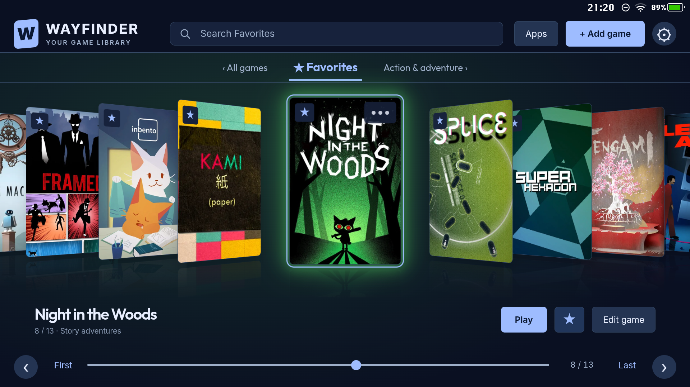
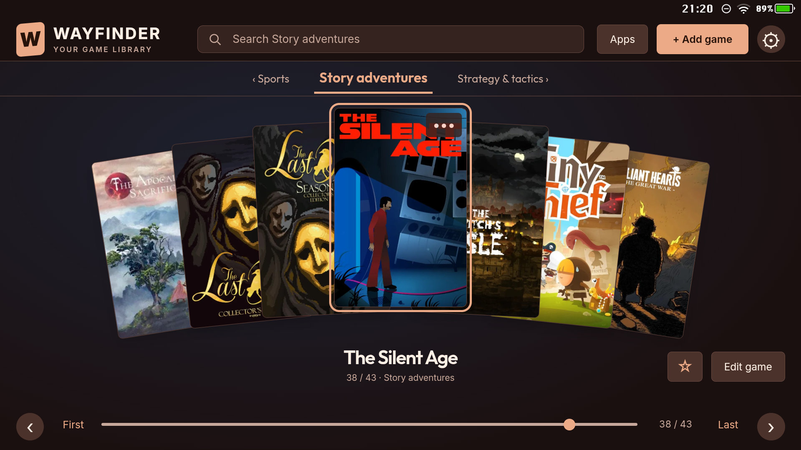
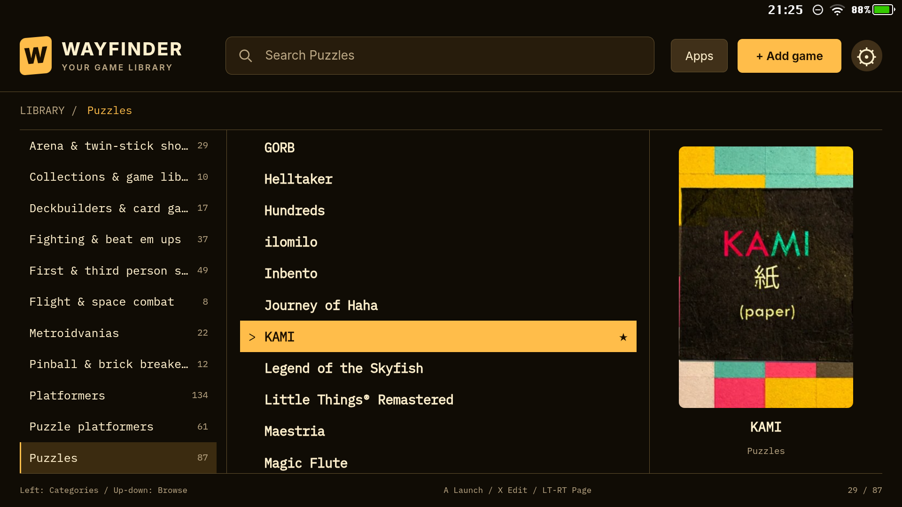
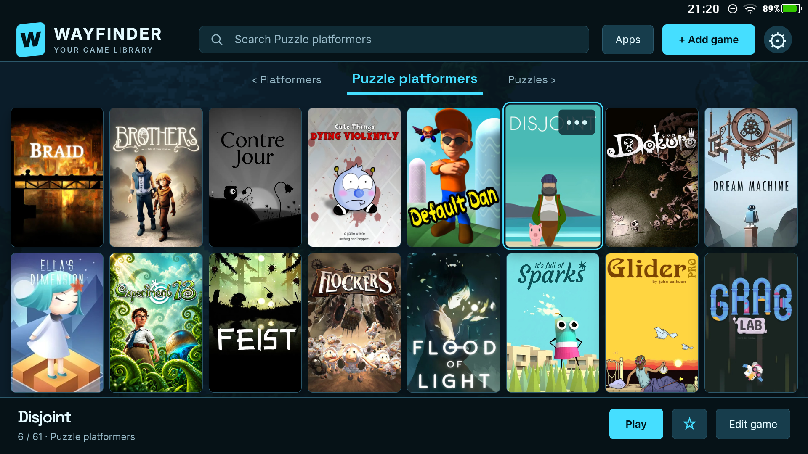
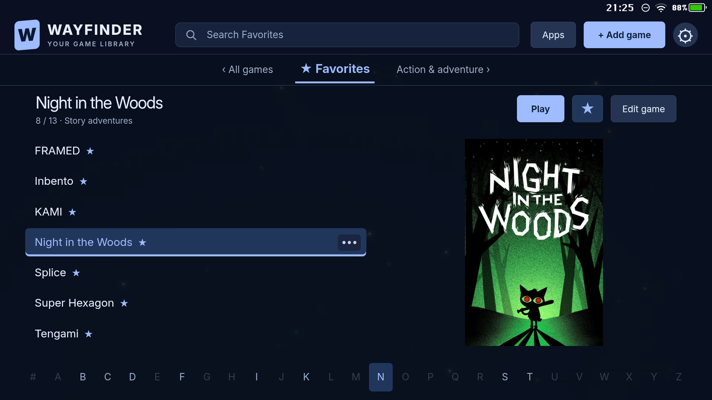
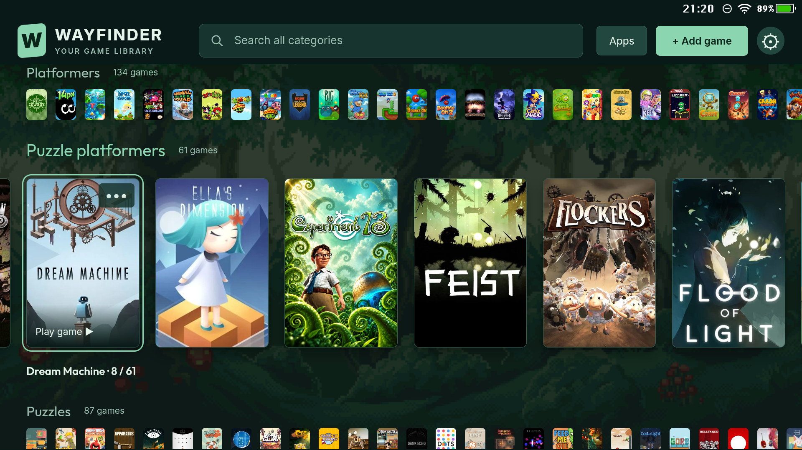

# Wayfinder screenshot gallery

[← Back to the README](../README.md)

Nine library views and a home for everyday apps. From a quiet title list to a card table, carousel, or wall of artwork, these ten screenshots show how differently the same collection can feel.

Captured directly on a Pimax Portal at **1920 × 1080** on September 27–28, 2026. These are unretouched screenshots of the app. Most show **v0.9.148 Beta 10**; Kyoto was refreshed on September 28 to show the refreshed layout and Smitchish preset now included in Beta 11. Appearance combinations, favorites, and the Copenhagen table were arranged for the gallery. Games and personal cover artwork are not bundled with Wayfinder. Animated backdrops appear as still frames.

[Copenhagen](#copenhagen) · [Cupertino](#cupertino) · [Ulm](#ulm) · [Venice](#venice) · [Cambridge](#cambridge) · [Kyoto](#kyoto) · [Berlin](#berlin) · [Oxford](#oxford) · [Vienna](#vienna)

[Beyond the game library: Apps](#beyond-the-game-library)

## Copenhagen

**Full House** — Felt · Default typography · Flat · Crisp shadows

Twelve games on a green felt table, with warm ivory accents and KAMI selected. Keep a pick, replace it, or shuffle the table.

## Cupertino

**Midnight favorites** — Midnight · Outfit · Soft Gradient · Artwork glow

Night in the Woods anchors a carousel of favorites, with angled covers and soft reflections.

## Ulm

**Paper and quiet** — Parchment · Editorial · Flat · Soft shadows

A spacious title list, understated controller hints, and a single Tengami cover show the quieter side of Wayfinder.

## Venice

**A fan of stories** — Terracotta · Outfit · Soft Gradient

A symmetrical fan of adventure covers surrounds The Silent Age, with warm accents and a restrained background.

## Cambridge

**The amber directory** — Amber · IBM Plex Mono · Flat

Categories, titles, and artwork occupy three clear panes. KAMI brings a little color to a compact, text-focused browser.

## Kyoto

**Smitchish** — Daylight · Outfit · Flat · Soft shadows

A pale, spacious shelf puts portrait artwork first. Dream Machine has a cyan selection outline, while a floating dock brings Play, Back, Edit, and Search together with colorful controller badges.

## Berlin

**Room for a collection** — Cyan · Space Grotesk · Underwater · Soft shadows

Sixteen covers fit into two complete rows. Disjoint is selected in a dense, easy-to-scan category grid.

## Oxford

**After Hours** — Midnight · Outfit · Fireflies

A clear list of favorites pairs with large cover art and a faint scattering of fireflies. Night in the Woods sets the mood for an evening of browsing.

## Vienna

**Woodland shelves** — Sea Glass · Outfit · Forest Illusion · Soft shadows

An expanded shelf of puzzle platformers sits between compact previews of neighboring categories over a subdued forest backdrop.

## Beyond the game library

Wayfinder also keeps your everyday Android apps close at hand, with grouped sections and a favorites dock.

**Everyday essentials** — Midnight · Outfit · Phosphor section icons

News, Media, Social, Tools, and System sit above a dock of pinned apps. Colorful controller hints and customized app icons complete the screen.

App icons shown use [Australis – Icon Pack by UNVOID](https://play.google.com/store/apps/details?id=com.unvoid.australis), available separately on Google Play. Section illustrations use [Phosphor Icons](https://phosphoricons.com/).

[← Back to the README](../README.md)
