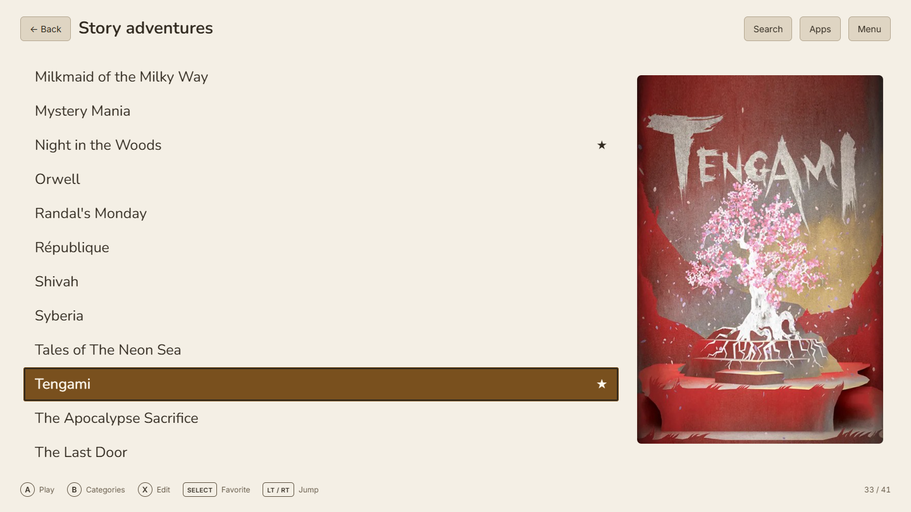
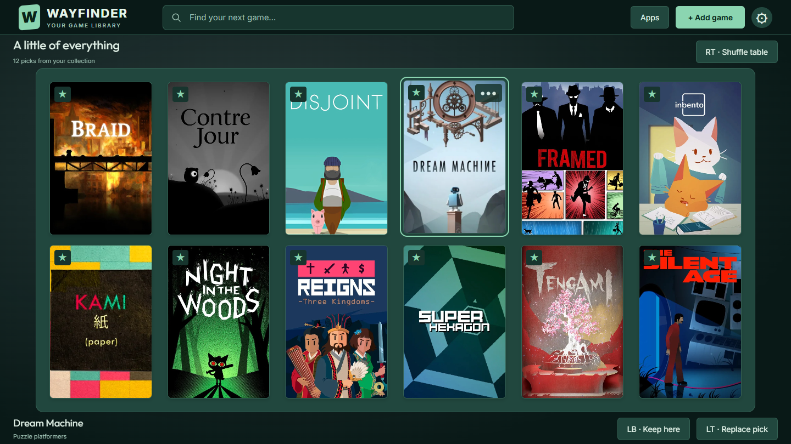
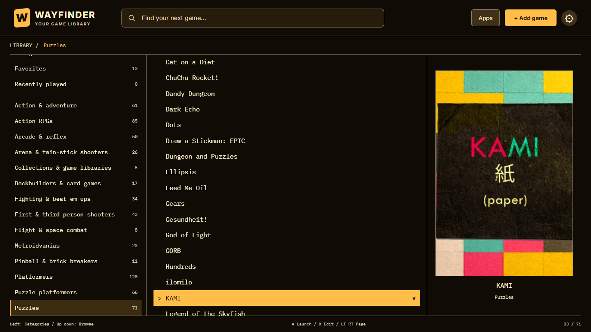
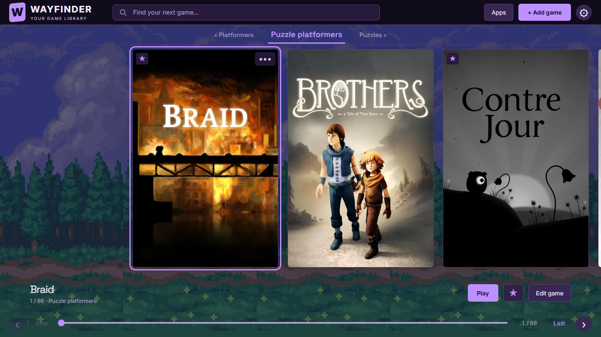
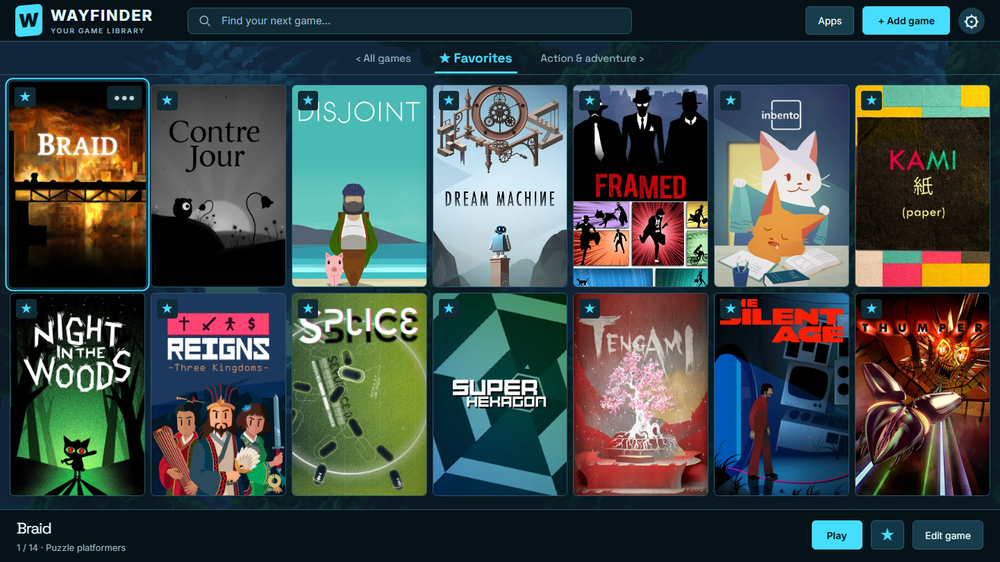
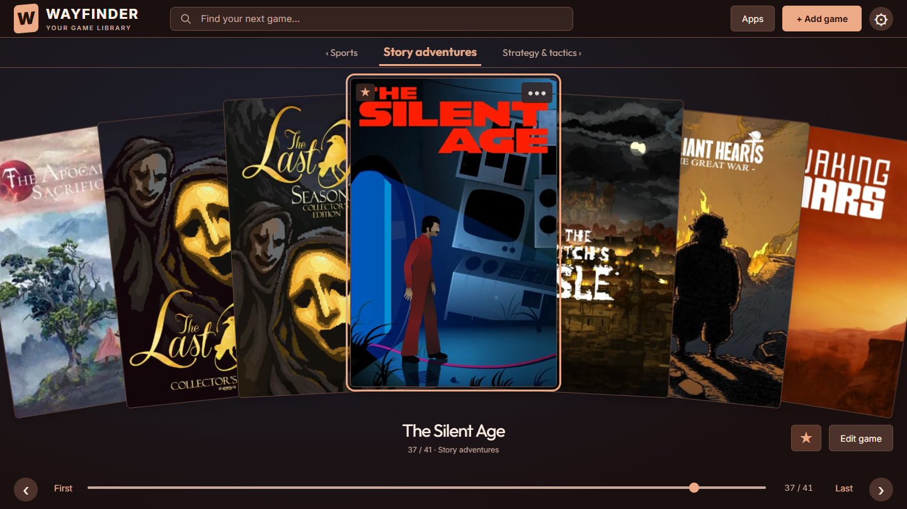
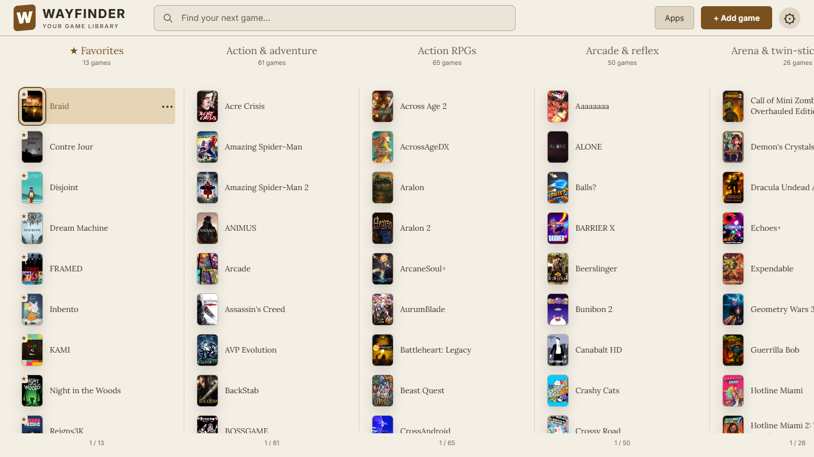
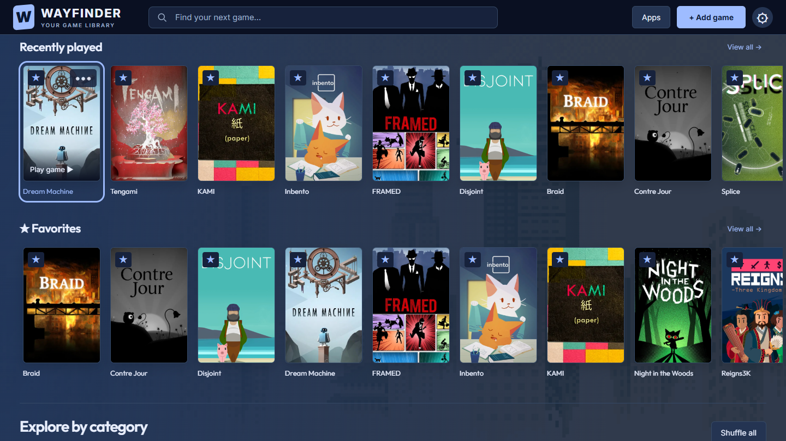

# Appearance gallery

[← Back to the README](../README.md)

Ten compositions from the same Android game collection: different layouts, palettes, typography, and backdrops, with one cover per game.

These are unretouched captures of the current development interface running in a browser, using a curated example collection. Some options shown may be newer than the published beta. Games and personal cover artwork are not bundled; animated backdrops are shown as still frames.

[Cupertino](#cupertino) · [Vienna](#vienna) · [Ulm](#ulm) · [Copenhagen](#copenhagen) · [Cambridge](#cambridge) · [Kyoto](#kyoto) · [Berlin](#berlin) · [Venice](#venice) · [Prague](#prague) · [Seattle](#seattle)

## Cupertino

**Silver collection** — Graphite · Outfit · Soft Gradient

Sculpted cover flow, subtle reflections, and a soft halo around Dream Machine.

## Vienna

**Woodland shelves** — Sea Glass · IBM Plex Sans · Forest Illusion

A generous favorites shelf above compact category previews, framed by a dim forest backdrop.

## Ulm

**Quiet company** — Parchment · Nunito · Flat

A warm, readable title list with Tengami’s paper-world artwork as its single focal point.

## Copenhagen

**A table of discoveries** — Sea Glass · Outfit · Soft Gradient

Twelve covers on a green table, with breathing room between each pick.

## Cambridge

**Title Commander** — Amber · IBM Plex Mono · Flat

An amber directory, a precise monospaced list, and KAMI’s bright paper cover.

## Kyoto

**Magical road** — Violet · Space Grotesk · Magical Road

Large covers against violet clouds and a softly dimmed pixel-art landscape.

## Berlin

**Into the blue** — Cyan · Space Grotesk · Underwater

Fourteen favorites in two complete rows, edged with cyan over a subtle underwater backdrop.

## Venice

**Story cards** — Terracotta · Outfit · Soft Gradient

A warm fan of adventure covers, with The Silent Age centered in front.

## Prague

**Paper catalogue** — Parchment · Editorial · Flat

A light catalogue of populated category columns, pairing small covers with titles.

## Seattle

**Evening discoveries** — Midnight · Outfit · Urban Skyline

Recently played games and favorites fill two shelves against a quiet evening skyline.

[← Back to the README](../README.md)
